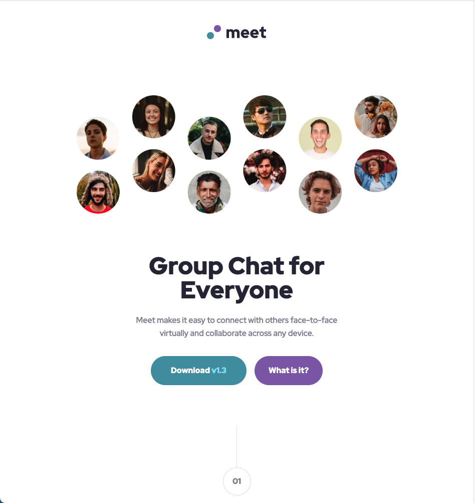
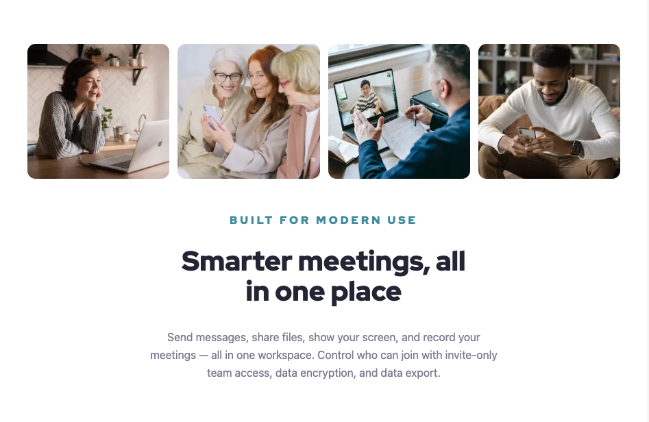
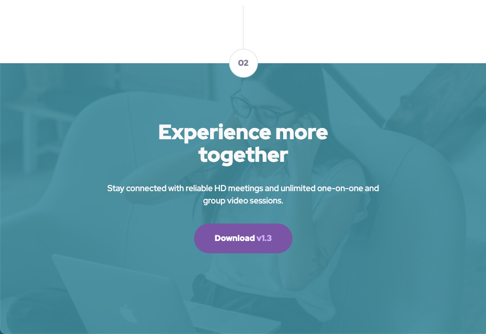

# Meet landing page

Designed by [Frontend Mentor](https://www.frontendmentor.io/challenges/meet-landing-page-rbTDS6OUR) and coded by [Gümrah Sindar](https://www.linkedin.com/in/gumrahsindar/)

## Table of contents

- [Overview](#overview)
  - [The challenge](#the-challenge)
  - [Screenshot](#screenshot)
  - [Links](#links)
- [My process](#my-process)
  - [Built with](#built-with)
- [Author](#author)

## Overview

### The challenge

Users should be able to:

- View the optimal layout depending on their device's screen size
- See hover states for interactive elements

### Screenshot

### Links

- Live Site URL: [Vercel](https://meet-landing-page-azure.vercel.app)

## My process

### Built with

- Semantic HTML5 markup
- CSS custom properties
- Flexbox
- CSS Grid
- Mobile-first workflow
- [React](https://react.dev/) - JS library
- [Next.js](https://nextjs.org/) - React framework
- [Tailwind](https://tailwindcss.com/) - For styles

## Author

- LinkedIn - [Gümrah Sindar](https://www.linkedin.com/in/gumrahsindar/)
- Frontend Mentor - [@gumrahsindar](https://www.frontendmentor.io/profile/gumrahsindar)
- Twitter - [@gmrhsndr](https://twitter.com/gmrhsndr)
