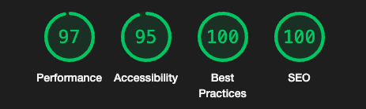

# Meet Landing Page

## 🚀 Features

- Optimal layout depending on their device's screen size.
- See hover states for interactive elements.

## 🛠️ Technologies Used

- **React JS**: JS library for web and native user interfaces
- **Tailwind**: Utility first CSS framework.

## 🌐 Live Demo

- <a href="https://meet-landing-page-azure.vercel.app" target="_blank">Visit Meet</a>

## 🌟 Lighthouse Score

  

## 🌄 Preview

  

## Author

- LinkedIn - [Gümrah Sindar](https://www.linkedin.com/in/gumrahsindar/)
